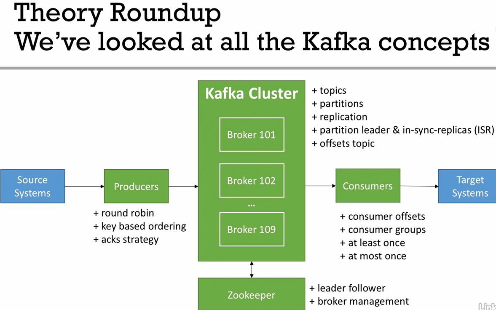

# Kafka Sample Project


## Start zookeeper
```bash
zookeeper-server-start.sh kafka_2.13-3.4.0/config/zookeeper.properties
```

## Start kafka server
```bash
kafka-server-start.sh kafka_2.13-3.4.0/config/server.properties
```

## Create a kafka topic
```bash
kafka-topics.sh --bootstrap-server ubuntu-vm:9092 --create --topic first_topic --partitions 3 --replication-factor 2
```

To set the minimum in-sync replicas to a specific number of brokers then append
`--config min.insync.replicas=2`

## Start console consumer
```bash
kafka-console-consumer.sh --bootstrap-server ubuntu-vm:9092 --topic first_topic --group my-first-application
```

## Start console producer
```bash
kafka-console-producer.sh --bootstrap-server ubuntu-vm:9092 --topic first_topic --producer.config kafka_2.13-3.4.0/config/producer.properties
```

## Reset consumer group offset for single topic console
```bash
kafka-consumer-groups.sh --bootstrap-server ubuntu-vm:9092 --reset-offsets --to-earliest --execute --group my-first-application --topic first_topic
```

## Reset consumer group offset for all topics console
```bash
kafka-consumer-groups.sh --bootstrap-server ubuntu-vm:9092 --reset-offsets --to-earliest --execute --group my-first-application --all-topics
```