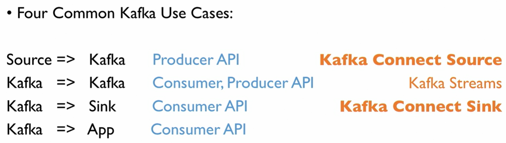
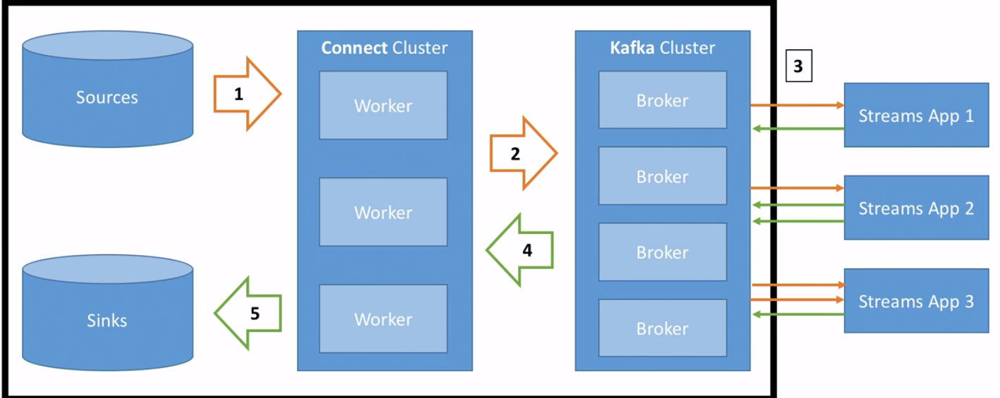

# Why use Kafka Connect?

- These extended APIs are used by companies for scaling kafka easier
- Kakfa Connect is used for Source and Sink Connectors to Common Data Sources
  - Common Data Sources include MongoDB, Cassandra, ElasticSearch, APIs, etc...
- Less code required
- Code reusability
- Used to acheive Fault Tolerance, Idempotence, Distribution, and Ordering
- Used in ETL Pipelines (Source to Data Warehouse)

## Use Kafka Connect Confluent Connectors
1. Go to https://www.confluent.io/product/connectors/
2. Find and pick your desired connector
3. Read and follow the introduction, installation, and configuration steps
   - These are likely shown in the source code `README.md` file or in https://docs.confluent.io 
4. Once you have the libaries required installed and the configuration files ready, then run `connect-standalone`