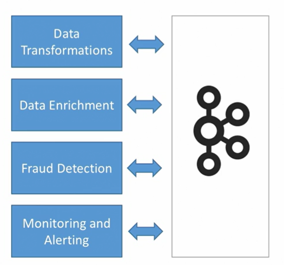
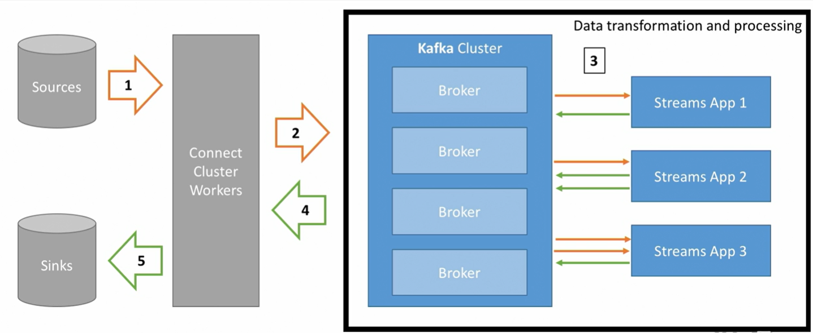

# Why use Kafka Streams?

Kafka Producer and Consumer is very low level and not developer friendly!

- Easy **data processing and transformation library** within Kafka
- Standard Java Application
- **Exactly Once** processing capability
- One record at a time processing (no batching)
- Scalable, elastic, and fault tolerant
- Retieve data from topic in Kafka cluster, process it, then put it back in Kafka to a different topic

## Example: Tweets Filtering
Tweet topic -> Consumer > Application Logic (Streams) -> Producer -> Filtered topic

## Use Kafka Streams
1. 